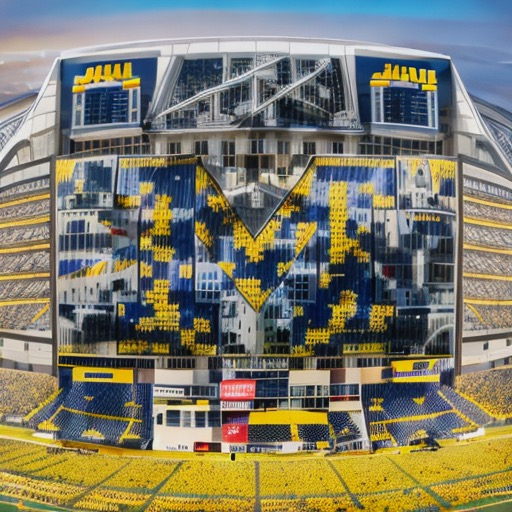

# stlyized-QR-code-generation

## Description
This project uses (Stable Diffusion)[https://ieeexplore.ieee.org/document/9878449] with four layers of (ControlNet)[https://github.com/lllyasviel/ControlNet] in order to generate QR codes that contain a company logo and also generated imagery. It requires a generated QR code for whatever link should be embedded and a company logo. 

## Installation
Clone the repository and then utilize the notebook with desired input images

## Usage

The `QRCodeGenerator` Class must be used with the images and ControlNet paramters as inputs. Specify the number of batches and images per batch as well.

```python
# initialize image generator
qr_code_generator = QRCodeGenerator()

# load images
qr_code = load_image('qr-test.jpg')
logo = load_image('nike.jpg')

# intialize prompt
prompt =  "Create an 8K high-resolution artwork featuring a prominent bright orange basketball, surrounded by dynamic ink explosions and elegant gold accents. Focus on high contrast, intricate details, and rich aesthetics, ideal for an 8K wallpaper. Apply 'lora:epi_noiseoffset 0:1' for enhanced artistry."

# hyperparams
controlnet_conditioning_scale=[0.3, 0.3, 0.5, 0.5]
controlnet_guidance_start=[0.45, 0.1, 0.23, 0]
controlnet_guidance_end=[0.7, 0.93, 1, 1]

num_batches = 4
num_images_per_batch = 4

grid, nike_images = qr_code_generator.generate_qr_code(qr_code, logo, prompt, num_batches, num_images_per_batch, controlnet_conditioning_scale, controlnet_guidance_start, controlnet_guidance_end)
grid
```

This model has four ControlNet inputs. The first two take in the QR code and the last two take in the logo. In order to generate the best output, the paramteters should be adjusted based on the specific logo/prompt combination. The conditioning scale reperesents the reltive importance of each ControlNet. The guidance start/end represent how far into the Stable Diffusion process does the ControlNet influence start/end.

In addition, the logo should be resized before hand in order to make it fit inside the QR code. This is also logo specific.

## Model

## Examples